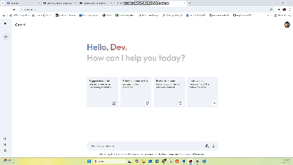

# Gemini Clone 🚀

## Project Overview:
Gemini Clone is a web application built using **ReactJS** that integrates with the **Gemini API** to create a seamless user interface. The app allows you to interact with Gemini's API, fetch dynamic content, and display it in a user-friendly format. 

### Tools and Technologies:
- **ReactJS**: A JavaScript library for building user interfaces.
- **Gemini API**: A popular cryptocurrency exchange API that allows access to real-time market data.
- **JavaScript (ES6+)**: Utilized for app logic and API interaction.
- **CSS**: For styling the application.

## Project Structure:
The application follows a clean and organized structure to ensure maintainability and scalability.

### src/
- **assets**: Contains images and other static assets. These are imported and exported via a variable for easy access across components.
- **components**: Contains the main UI components:
  - **Main.jsx**: This is the main layout of the app, where the core functionality is displayed.
  - **Sidebar.jsx**: Contains the sidebar for navigation and additional UI elements.
- **config**: Holds configuration files, including the API Key needed to access the Gemini API.
- **context**: Used to display dynamic text by determining the type of user and responding accordingly.
- **App.jsx**: The main component that is responsible for the overall structure of the application, and it incorporates the business logic to interact with Gemini's API.
- **main.jsx**: The entry point of the React app that initializes the React application, links the `App` component to the DOM, and triggers the rendering process in the browser.

## Key Features:
- **React-based interface**: Utilizes ReactJS to build a dynamic and responsive frontend.
- **API Integration**: The application calls the **Gemini API** to fetch live data, including cryptocurrency prices and other related information.
- **Dynamic Content**: The application adapts based on the user type and interacts dynamically with the API to show relevant data.
- **Sidebar Navigation**: Includes a sidebar component to make the UI more interactive and user-friendly.

## Installation and Setup:

1. **Clone the Repository**:
   To get started, clone this repository to your local machine:
   ```bash
   git clone https://github.com/your-username/gemini-clone.git
   ```

2. **Install Dependencies:**:
   Navigate into the project directory and install the required dependencies:
   ```bash
   cd gemini-clone
   npm install
   ```

3. **Set Up Gemini API Key:**:
- Create an account on Gemini if you haven't already.
- Obtain your API key from the Gemini account settings.
- Create a .env file in the root directory of the project and add your API key:
   ```bash
   VITE_API_KEY=your_api_key_here
   ```

4. **Run the Application:**:
   Start the React development server:
   ```bash
   npm run dev 
   ```
   This will open the application in your default browser.

## Preview:

 